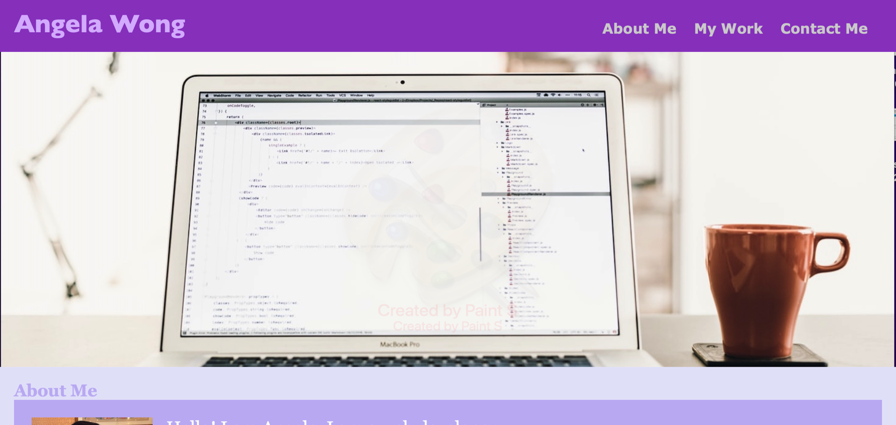
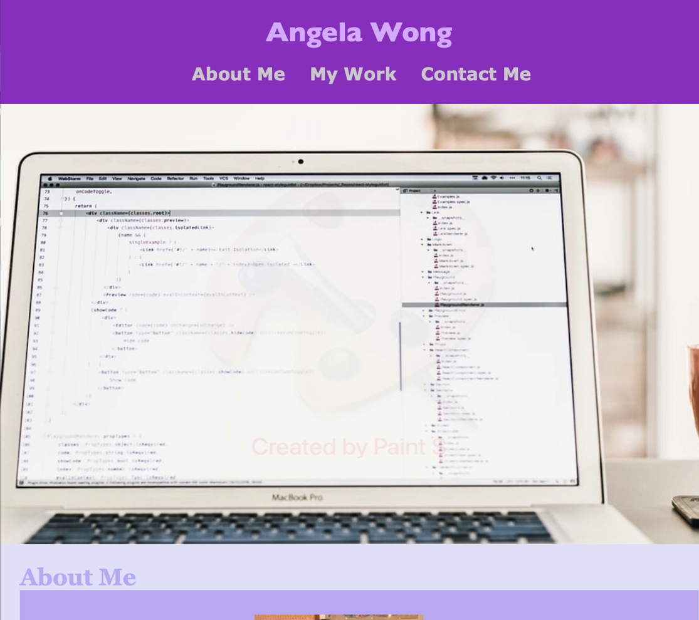
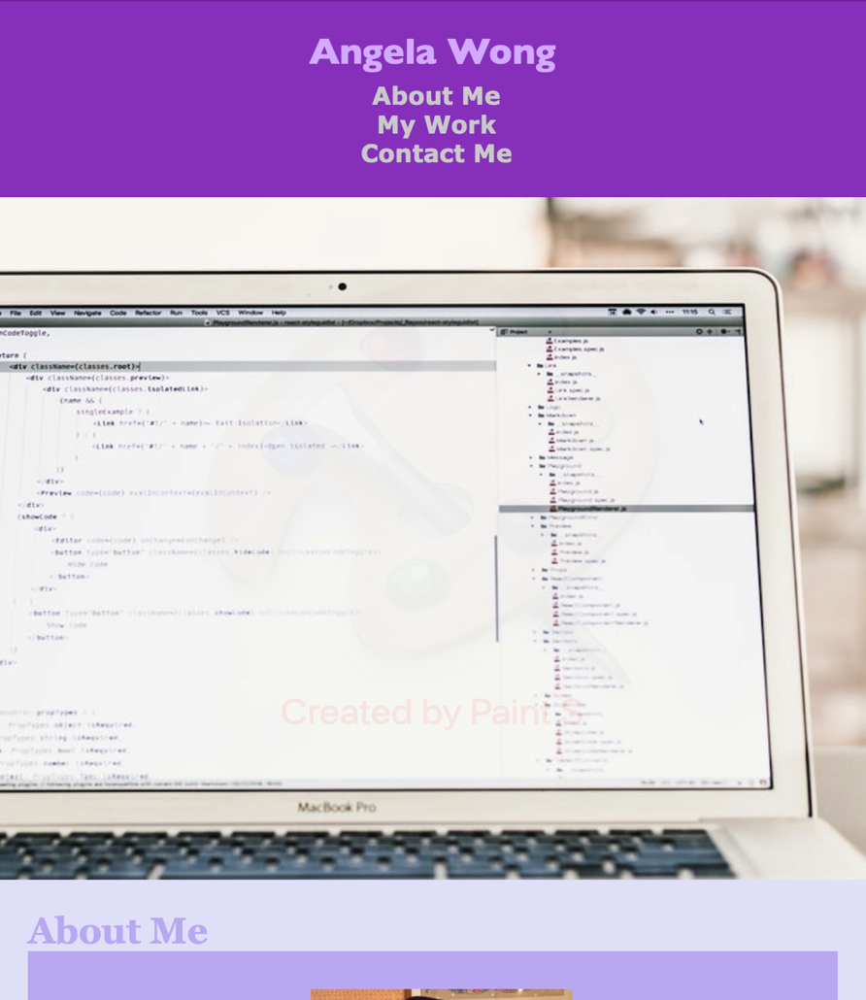

# Advanced CSS Portfolio

## This is the repository for my portfolio

The Webpage includes: 
1. Header with a navigation bar, and a header image
2. Content with 3 sections: about me, my work, and contact me
3. Footer 

## The Page fits different devices, i.e. desktops, tablets, and smartphones.

Desktop:

Tablet:

Smartphone:

### Link: 
Click [https://angelawong3.github.io/advanced-CSS-Portfolio/](https://angelawong3.github.io/advanced-CSS-Portfolio/) to go to the page. 

---
© Angela Wong